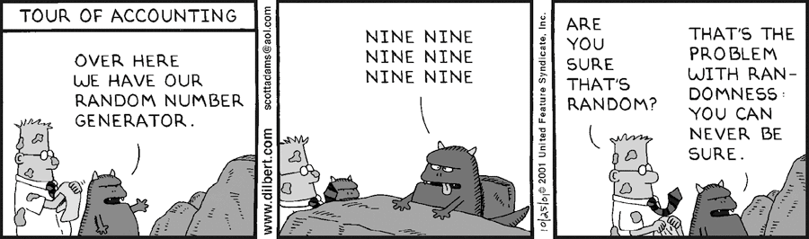

## Imputing missing data for a classification problem

*Authors: Karol Saputa, Małgorzata Wachulec, Aleksandra Wichrowska (Warsaw University of Technology)*

As students of the same university course, we were asked to sum up the findings of our colleges, the authors of the *Default imputation efficiency comparison* article. In their work, they used many missing data imputation techniques on 11 datasets, on which they then run different classification algorithms. By measuring the results obtained using these imputation algorithms they could judge their performance. But first:

#### What is data imputation?

Some datasets have missing values that many classification algorithms cannot handle. One way to make the algorithm work is to delete the observations that include missing data or, if missing values come just from a few columns, we can delete them instead. Unfortunately, this means we might be loosing some important piece of information and this is where data imputation comes in - it’s a technique to fill out empty spaces with numerical or categorical values, which should improve significantly the outcome of classification that is run on such dataset.

#### Data imputation techniques

Our colleges tried many naive approaches, such as removing columns with missing values, imputing with random values from given feature, or imputing with median (for numerical features) and with mode (for categorical features). They also tried more refined missing data approaches, such as the Random Forest from missForest package, KNN, hot-deck algorithm and Iterative Robust Model-Based Imputation (IRMI) from VIM package, as well as predictive mean matching (pmm) and classification and regression trees (cart) from mice package. This way, they compared a whole spectrum of simple and not-so-simple missing data imputation techniques available in R.

#### How the performance was measured

Tutaj pewnie coś o modelach i tym rankowaniu

#### What random generators are used for

Omówienie wyników ich eksperymentu

