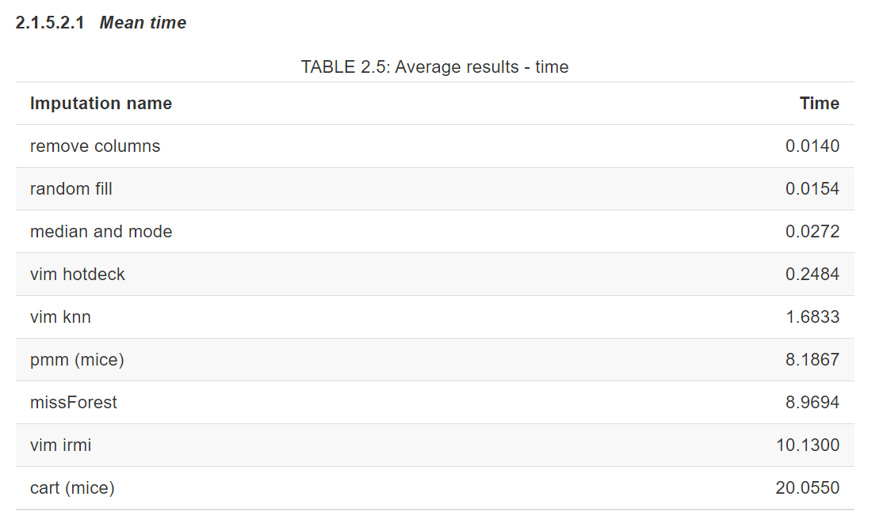
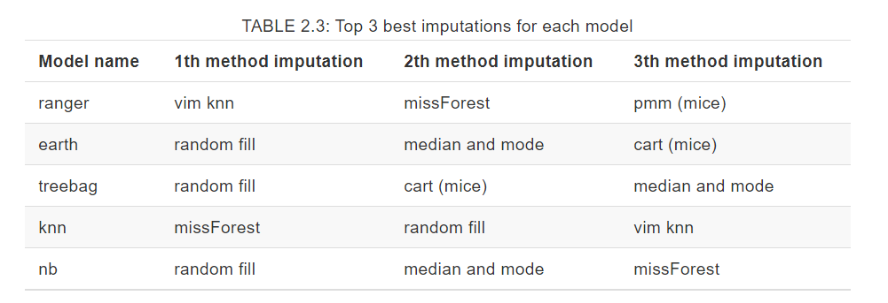
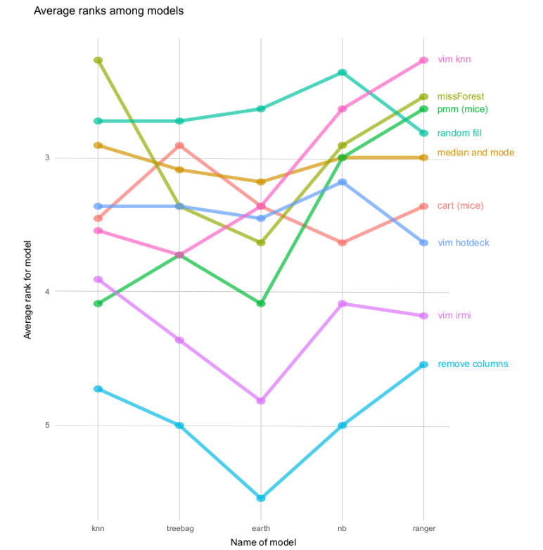

### Imputing missing data for a classification problem

*Authors: Karol Saputa, Małgorzata Wachulec, Aleksandra Wichrowska (Warsaw University of Technology)*

As students of the same university course, we were asked to sum up the findings of our colleges, the authors of the *Default imputation efficiency comparison* article. In their work, they used many missing data imputation techniques on 11 datasets, on which they then run different classification algorithms. By measuring the results obtained using these imputation algorithms they could judge their performance. But first:

#### What is data imputation?

Some datasets have missing values that many classification algorithms cannot handle. One way to make the algorithm work is to delete the observations that include missing data or, if missing values come just from a few columns, we can delete them instead. Unfortunately, this means we might be loosing some important piece of information and this is where data imputation comes in - it’s a technique to fill out empty spaces with numerical or categorical values, which should improve significantly the outcome of classification that is run on such dataset.

| Name| Height | Weight | Weight (with mean imputation)
| --------|----------|----------| ----------|
| Max | 175 | 60 | 60|
| Frederic | 169 | **NA** | 70 |
| Thomas | 186 | 80 | 80 |

Table: An example of a dataset with missing value. NA means a missing value (Not Available)

As we can see in an example above we'd like to keep a data point with Frederic instead of deleting it. The simplest way of doing that was to create a new feature where missing values are filled with a mean of all that column values (Weight). Let's see how using different approaches can have impact on our machine learning model results.

#### Data imputation techniques

Our colleges tried many naive approaches, such as removing columns with missing values, imputing with random values from given feature, or imputing with median (for numerical features) and with mode (for categorical features). They also tried more refined missing data approaches, such as the Random Forest from missForest package, KNN, hot-deck algorithm and Iterative Robust Model-Based Imputation (IRMI) from VIM package, as well as predictive mean matching (pmm) and classification and regression trees (cart) from mice package. This way, they compared a whole spectrum of simple and not-so-simple missing data imputation techniques available in R.

#### How the performance was measured

Two factors were considered, time of impution algorithm consumed and performance gain for a set of machine learning models.

As we can see, the time difference is significant. We can choose between simple and fast methods and slower, more complex ones. 

##### Ranking of methods for each model

***____description of ranking_____***

##### Random fill to get best results

Both table and plot show us that filling NAs with random values from that column gives very good results. It is indepentend from machine learning model chosen and fast method to start your work with a new dataset.

However, what is also mentioned in a paper, if you have big dataset (bigger than used here), there is still a chance that more complex methods will give better results. It is something to try and research in the future.

#### What random generators are used for - random fil as a best method

### References
1. Jakub Pingielski, Paulina Przybyłek, Renata Rólkiewicz, Jakub Wiśniewski. (2020) Default imputation efficiency comparison. Warsaw University of Technology
[https://mini-pw.github.io/2020L-WB-Book/default-imputation-efficiency-comparison.html]

