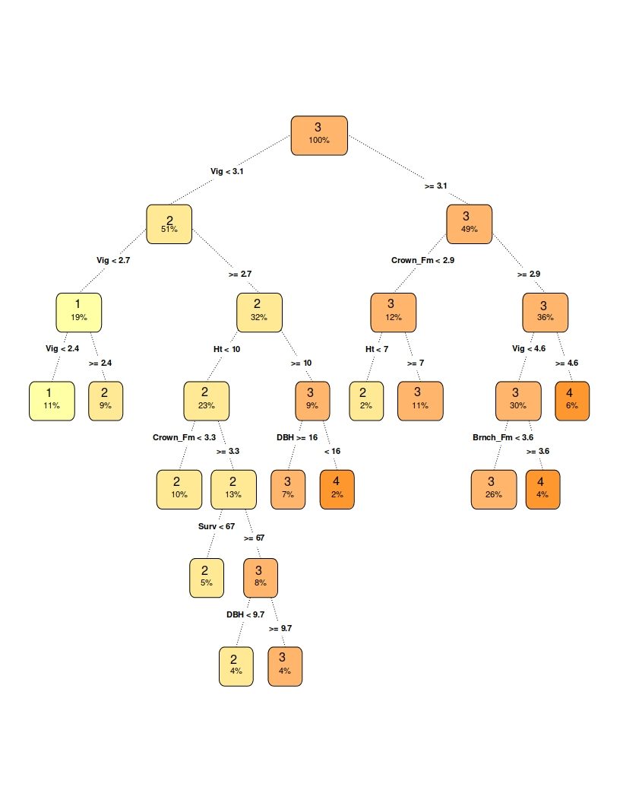

```{r setup, include=FALSE}
knitr::opts_chunk$set(echo = FALSE)
```


## Plan

- Research purpose
- Ordinal classification
- Dataset
- Methodology
- Results
- Model explanation

## Research purpose


## Ordinal classification

## Dataset

## Methodology


## Results
| Model| AUC | MSE | ACC | ACC1| % Best AUC | 
|-|-|-|-|-|-|
| Basic rpart | 0.8259 | 0.5284 | 0.5835 | 0.9797 | 95.89% |
| Regr rpart var-sel.| 0.8613 |	0.4996 | 0.5815 |	0.9323 |	100.00% |
| Xgboost | 0.8590 | 0.4467 | 0.6248 | 0.9873 | 99.73% |
| Xgboost small | 0.8405 | 0.4998 | 0.6044 | 0.9830 | 97.59% | 

## Results

<wykres> 

## Model Explanation



## Conclusions

##


